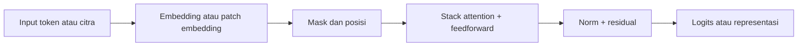

# Engineering README

Dokumen ini menjelaskan struktur teknis repositori `x-transformers`, cara kerja transformer di dalamnya, dan titik masuk yang relevan untuk pengembangan lanjutan.

## Tujuan Proyek

Repositori ini menyediakan implementasi transformer yang ringkas namun luas cakupannya. Fokus utamanya adalah:

- abstraksi model yang fleksibel untuk decoder-only, encoder-only, dan encoder-decoder
- dukungan untuk masking, cross-attention, cache, dan varian pelatihan yang lebih spesifik
- pemakaian ulang komponen inti agar eksperimen model tetap terkontrol

## Arsitektur Tingkat Tinggi

| Lapisan | Peran | Implementasi utama |
| --- | --- | --- |
| Token embedding | Mengubah indeks token menjadi vektor kontinu | `TransformerWrapper` |
| Attention layer | Menghitung hubungan antar-token | `Attention`, `Decoder`, `Encoder` |
| Feedforward | Memberi transformasi non-linear | `FeedForward` |
| Normalisasi | Menstabilkan optimisasi | `RMSNorm`, `AdaptiveRMSNorm` |
| Wrapper tugas | Menyesuaikan model dengan skenario penggunaan | `XTransformer`, `ViTransformerWrapper`, `AutoregressiveWrapper` |

## Alur Data



Pada decoder-only, model membaca token sebelumnya untuk memprediksi token berikutnya. Pada encoder-only, model membangun representasi konteks. Pada encoder-decoder, encoder menghasilkan konteks sumber dan decoder memanfaatkannya melalui cross-attention.

## File Penting

| File | Fungsi |
| --- | --- |
| `x_transformers/x_transformers.py` | Definisi arsitektur inti dan sebagian besar blok transformer |
| `x_transformers/attend.py` | Implementasi attention dan utilitas terkait |
| `x_transformers/autoregressive_wrapper.py` | Wrapper generasi autoregresif |
| `x_transformers/nonautoregressive_wrapper.py` | Wrapper untuk skenario non-autoregresif |
| `x_transformers/continuous.py` | Transformer untuk input kontinu |
| `x_transformers/multi_input.py` | Transformer untuk beberapa jenis input token |
| `tests/test_x_transformers.py` | Referensi perilaku yang diharapkan |
| `sample/README.md` | Contoh penggunaan publik paket |

## Titik Masuk Penggunaan

### Decoder-only

Gunakan `TransformerWrapper(..., attn_layers = Decoder(...))` saat tujuan utama adalah prediksi token berikutnya.

### Encoder-only

Gunakan `TransformerWrapper(..., attn_layers = Encoder(...))` saat model dipakai untuk klasifikasi, pemadatan representasi, atau embedding konteks.

### Encoder-decoder

Gunakan `XTransformer` untuk skenario sumber-ke-target seperti terjemahan, ringkasan, dan captioning.

## Konvensi Implementasi

- Pertahankan API yang eksplisit dan komposisional.
- Jaga bentuk tensor tetap terdokumentasi melalui pengujian dan contoh minimal.
- Jika menambah fitur baru, uji pada level unit sebelum memperluas ke sample atau notebook.
- Utamakan perubahan kecil pada blok inti daripada menumpuk logika di wrapper tingkat atas.

## Verifikasi Teknis

Langkah validasi yang disarankan:

1. Jalankan pengujian inti.
2. Periksa shape keluaran pada contoh minimal.
3. Verifikasi skenario khusus, misalnya cache, masking, atau cross-attention.

Contoh perintah:

```bash
pytest sample/tests/test_x_transformers.py
```

## Catatan Pengembangan

- Notebook `x-transformer.ipynb` dipakai sebagai penjelasan konseptual dan demonstrasi API.
- Folder `sample/` berperan sebagai referensi penggunaan dan pengujian perilaku.
- Jika dokumentasi publik diperluas, pertahankan konsistensi istilah antara notebook, README engineering, dan test.